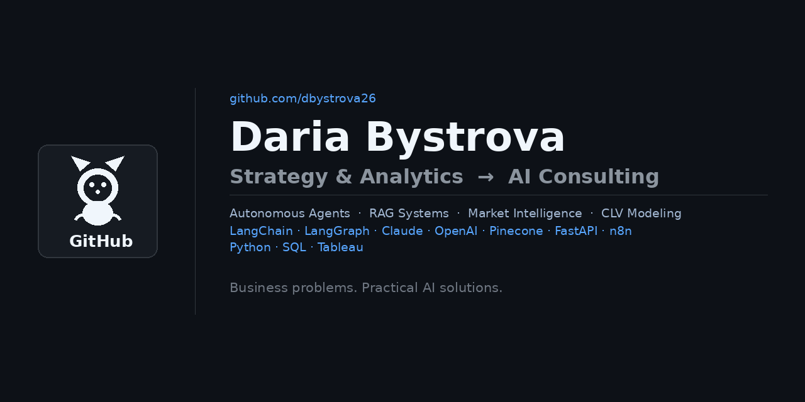

# Hi, I'm Daria 👋

Strategy & Analytics Professional → AI Consulting | Frankfurt 🇩🇪

I have 10+ years of experience in strategic analysis, investment, and cross-functional project leadership across Russia and Europe — at KPMG, GP Bullhound, WeWork, Bob W, and Numa Group. I'm passionate about how AI can change the modern workplace and streamline operations, and I'm now building that bridge between deep business experience and applied AI.

**I don't come from engineering. I come from the business side — and I think that's the point.**

Most AI tools fail not because of the technology, but because they're built without understanding the operational context they're supposed to fix. My focus is on applied AI that solves real workflow problems: automating manual research, generating structured intelligence, and supporting decisions that currently require hours of human effort.

---

## 🧭 What I care about

- **AI as a business tool, not a technical exercise** — the measure of success is whether it saves time and improves decisions, not whether the architecture is impressive
- **Grounding outputs in real context** — generic AI is noise; useful AI is grounded in the specific knowledge, voice, and constraints of the business it serves
- **Bridging strategy and implementation** — having led analytical teams and advised C-level stakeholders, I understand what decision-makers actually need from a tool
- **Practical, not perfect** — working systems that solve the problem today beat elegant solutions that arrive too late

---

## 📌 Selected projects

### AI Applications

| Project | What it does | GitHub |
|---|---|---|
| **Pricehunt — Autonomous Voucher Agent** | Autonomous LangGraph agent that hunts, scores and explains discount codes across 5+ sources in real time. Searches the web via Tavily, reflects on its own output, retries with a different plan if needed, and stays in a chat loop so users can refine results in plain language. Built with Claude Sonnet, MCP tool servers, FastAPI, and deployed on Render. Live demo available. | [Link](https://github.com/dbystrova26/pricehunt-autonomous-voucher-agent) |
| **A&R Artist Intelligence Agent** | Autonomous artist research & signing recommendation system for independent digital music distribution. Pulls data from Spotify, Last.fm, YouTube, NewsAPI and a Pinecone roster database — scores artists 0–100 and returns SIGN / WATCH / PASS with a full 9-section report. Sends Slack alerts and logs all decisions to Google Sheets via n8n. | [Link](https://github.com/dbystrova26/artist-research-signing-recommendation-agent) |
| **Artist & Industry Intelligence Report Generator** | AI-powered monthly market intelligence report engine for the world's largest independent music distributor. Input period and markets → get a structured internal report covering streaming trends, platform updates, competitor moves, and opportunities for DE, UK, and FR — grounded in a curated knowledge base. | [Link](https://github.com/dbystrova26/artist-and-industry-intelligence-ai-agent) |
| **AI Podcast Studio** | Automated podcast generator — turn any PDF, URL, or text into a two-speaker MP3 podcast in under 60 seconds. Powered by GPT-4o for script generation and OpenAI TTS for audio, with a Gradio interface. | [Link](https://github.com/dbystrova26/ai-podcast-generation) |
| **MeetingMind** | AI-powered meeting transcription system using OpenAI Whisper. Converts audio to text with timestamps, chunking for long recordings, and export to text, JSON, and SRT formats. Compares prompted vs unprompted transcription approaches. | [Link](https://github.com/dbystrova26/Ironhack_Day5) |
| **DocInsight** | AI-powered document Q&A via RAG pipeline. Ask questions across multiple files simultaneously — PDFs, transcripts, reports — and get answers grounded exclusively in your knowledge base. Built with OpenAI embeddings and GPT-4o. | [Link](https://github.com/dbystrova26/DocInsight-AI-Powered-Document-QA-via-RAG-Pipeline) |

### Data Analytics

| Project | What it does | GitHub |
|---|---|---|
| **RETAIN AND GAIN — Capstone Project** | CLV modeling and discount incrementality analysis on e-commerce transaction data. Combines probabilistic buy-till-you-die models (BG-NBD, Pareto/NBD, MBG-NBD + Gamma-Gamma), causal lift estimation via difference-in-differences, and unsupervised customer segmentation. Delivered as a full analytics pipeline with Tableau dashboards for finance and marketing decision support. | [Link](https://github.com/dbystrova26/RETAIN_AND_GAIN_Capstone_Project) |

---

## 🧰 Tools and technologies

**AI & agents:** `LangChain` `LangGraph` `OpenAI` `Claude` `Pinecone` `Embeddings` `RAG`  
**Deployment & automation:** `FastAPI` `Gradio` `n8n` `Render`  
**Data & analytics:** `Python` `SQL` `PostgreSQL` `Tableau` `Pandas` `NumPy` `Scikit-learn` `Seaborn` `Matplotlib` `SQLAlchemy` `dbt` `DBeaver` `Lifetimes` `Jupyter` `Git`  
**Finance & strategy tools:** `Advanced Excel` `Bloomberg Terminal` `Capital IQ` `Pitchbook`  
**Languages:** Russian (native) · English (full professional) · German (C2)

---

## 🎓 Education

- **AI Consulting Bootcamp** — Ironhack, Berlin (Apr 2026 – ongoing)
- **Data Analytics Bootcamp** — Spiced Academy by Neue Fische, Berlin (2025)
- **PhD in Economics** — Plekhanov Russian University of Economics (2015–2020)
- **MBA in International Management, Distinction** — ESCP Europe, Turin–Berlin–Paris (2017–2018)
- **MSc Investments, Merit** — University of Birmingham, UK (2012–2013)
- **BSc Business Analytics, Distinction** — Plekhanov Russian University of Economics (2006–2011)

---

## 📫 Connect

